# ON1Builder ‑ MEV & Flash‑Loan Arbitrage Bot

[](https://www.python.org/downloads/release/python-3120/)

[](LICENSE)

---

## Table of Contents
1. [Executive Summary](#1-executive-summary)  
2. [Project Overview](#2-project-overview)  
3. [Architecture & Components](#3-architecture--components)  
4. [Key Features & Statistics](#4-key-features-and-statistics)  
5. [Dependencies & Ecosystem](#5-project-dependencies-and-ecosystem)  
6. [Node Setup](#6-node-setup)  
   6.1. [Geth (Go Ethereum)](#61-geth-go-ethereum-setup)  
   6.2. [Beacon Node (Prysm)](#62-beacon-node-prysm-setup)  
7. [Free‑Trial API Keys](#7-free-trial-api-keys)  
8. [Future Enhancements](#8-future-enhancements-and-considerations)  
9. [Installation & Usage](#9-installation-configuration--usage)  
   9.1. [Prerequisites](#91-prerequisites)  
   9.2. [Install Steps](#92-installation-steps)  
   9.3. [Configuration](#93-configuration)  
   9.4. [Run the Bot](#94-usage)  
   9.5. [FlashLoanSimple via Remix](#95-flashloan-deployment-via-remix)  
   9.6. [Contributing](#96-contributing)  
   9.7. [License & Disclaimer](#97-license--disclaimer)  
10. [Appendix – Diagrams](#10-appendix-charts-and-diagrams)

---

## 1. Executive Summary
ON1Builder is a fully asynchronous MEV & flash‑loan arbitrage engine for Ethereum (mainnet & testnets).  
It fuses:

* **Aave v3 FlashLoanSimple** smart‑contract execution  
* **DEX routing** (Uniswap/Sushi)  
* **Machine‑learning price prediction**  
* **Reinforcement‑learning strategy selection**  
* A live **Flask + Socket.IO dashboard**  
* **Extensive logging & test coverage**

---

## 2. Project Overview
| Layer            | Description |
|------------------|-------------|
| **Smart‑Contract** | `SimpleFlashloan.sol` – triggers Aave v3 flash‑loans and wraps arbitrage logic. |
| **Python Core**  | Async modules: `MarketMonitor`, `TransactionCore`, `StrategyNet`, `NonceCore`, `SafetyNet`. |
| **Config**       | `.env` + JSON (token maps, ABIs). |
| **Dashboard**    | `ui/index.html` + Socket.IO stream for live metrics & controls. |
| **Tests**        | 40 + unit / integration / e2e tests (pytest & unittest). |

---

## 3. Architecture & Components

### Environment & Configuration
* `.env` for gas/slippage, API keys, node endpoints, wallet keys.  
* `configuration.py` validates vars & creates required dirs.

### Smart Contracts
* **`SimpleFlashloan.sol`**  
  * `requestFlashLoan()` – kick‑off.  
  * `executeOperation()` – arbitrage logic, must finish with repayment.  
  * Owner‑only withdrawals.
* JSON ABIs for ERC‑20, Aave Pool, Uniswap Router, Sushi Router.

### Python Modules (high‑lights)
| Module          | Purpose |
|-----------------|---------|
| `apiconfig.py`  | Handles rate‑limited API calls (Infura, Alchemy, CoinGecko…). |
| `marketmonitor.py` | Streams prices & re‑trains linear regression hourly. |
| `transactioncore.py` | Builds / simulates EIP‑1559 TXs; MEV (FR, BR, Sandwich). |
| `strategynet.py` | RL agent picking strategies based on reward = profit – gas – risk. |
| `noncecore.py`  | Atomic nonce tracking with TTL cache. |
| `safetynet.py`  | Rejects unprofitable or high‑slippage TXs in real‑time. |
| `maincore.py`   | Orchestrator (asyncio event‑loop, health checks, graceful exit). |

### Dashboard
`ui/index.html` → CPU/RAM, gas price, success‑rate, P&L, start/stop buttons.

---

## 4. Key Features and Statistics
| Strategy    | What it Does | Core Params |
|-------------|--------------|------------|
| Flash‑Loan  | Borrow → Trade → Repay in one TX | assets[], amounts[] |
| Front‑Run   | Out‑gas a pending high‑value TX | gasMultiplier, riskScore |
| Back‑Run    | Buy dip created by a TX | dipThreshold |
| Sandwich    | FR + BR around a swap | entryGas, exitGas, minProfit |

_Current benchmarks (test‑net): 95.6 % success rate, 0.256 ETH avg profit per profitable TX._

---

## 5. Project Dependencies and Ecosystem
* **Blockchain / RPC:** Web3.py • Geth • Infura • Alchemy  
* **DEX / Lending:** Aave v3 • Uniswap • Sushiswap  
* **ML & Data:** scikit‑learn • Pandas • NumPy  
* **Web / Real‑time:** Flask • Flask‑SocketIO  
* **Testing:** pytest • unittest

---

## 6. Node Setup

### 6.1 Geth (Go Ethereum) Setup
```bash
# Ubuntu / Debian
sudo add-apt-repository -y ppa:ethereum/ethereum
sudo apt update && sudo apt install -y geth

# macOS
brew tap ethereum/ethereum
brew install ethereum
```

**Initialize & fast‑sync**
```bash
geth --datadir ~/.on1builder/geth init genesis.json
geth --datadir ~/.on1builder/geth \
     --http --http.addr "0.0.0.0" \
     --http.api eth,net,web3,personal,txpool \
     --syncmode fast
```

_optional: systemd service for auto‑restart._

### 6.2 Beacon Node (Prysm) Setup
```bash
curl -o prysm.sh https://raw.githubusercontent.com/prysmaticlabs/prysm/master/prysm.sh
chmod +x prysm.sh

# Beacon chain
./prysm.sh beacon-chain \
  --datadir=$HOME/.on1builder/prysm \
  --http-web3provider=http://127.0.0.1:8545 \
```

---

## 7. Free‑Trial API Keys
| Provider      | Free Tier                              | Sign‑up |
|---------------|----------------------------------------|---------|
| **Infura**    | 100 k requests / day                   | <https://infura.io/register> |
| **Alchemy**   | 500 k requests / month                 | <https://app.alchemy.com/signup> |
| **Etherscan** | 5 req / sec, 100 k / day               | <https://etherscan.io/register> |
| **CoinGecko** | 50 req / min (no key needed)           | <https://www.coingecko.com/en/api> |
| **CoinMarketCap** | 10 k calls / month                | <https://pro.coinmarketcap.com/signup> |
| **CryptoCompare** | 100 k calls / month               | <https://min-api.cryptocompare.com> |

_Add these to `.env` → “API Keys and Endpoints” section._

---

## 8. Future Enhancements and Considerations
* Replace linear regression with LSTM / Transformer models.  
* Add on‑chain sentiment & gas‑bribing to `StrategyNet`.  
* Multi‑chain (BNB, Polygon, Arbitrum).  
* Third‑party audits for contracts & core.  
* Interactive dashboard charts (Plotly).  

---

## 9. Installation, Configuration & Usage

### 9.1 Prerequisites
* Linux (Ubuntu 20.04+), macOS 12+, or Windows 10/11  
* **Python 3.12+**  
* Synced **Geth** & (optional) **Prysm** nodes  
* 4 CPU, 16 GB RAM, NVMe SSD (recommended)

### 9.2 Installation Steps
```bash
git clone https://github.com/John0n1/ON1Builder.git
cd ON1Builder

python3 -m venv venv
source venv/bin/activate           # Windows: .\\venv\\Scripts\\activate

pip install --upgrade pip
pip install -r requirements.txt
cp .env.example .env
nano .env                           # fill RPC URLs, wallet key, API keys
```

### 9.3 Configuration
Everything lives in **`.env`**; token / ABI maps in **`utils/`** & **`abi/`**.

### 9.4 Usage
```bash
source venv/bin/activate
python python/main.py
```
*Dashboard:* `http://<server-ip>:5000`

### 9.5 FlashLoanSimple Deployment via Remix
1. **Open Remix** → <https://remix.ethereum.org>  
2. **Create `SimpleFlashloan.sol`** – paste Aave v3 FlashLoanSimple code.  
3. **Compile** (Solidity ^0.8).  
4. **Deploy**  
   * Deploy & Run → *Environment:* **Injected Web3** (MetaMask).  
   * Select network (Goerli, Sepolia, mainnet).  
   * Hit **Deploy**.  
5. **Call** `requestFlashLoan(asset, amount, params)` – params can be empty `0x`.  
6. **Verify** on Etherscan; ensure `executeOperation` event logs show profit and repayment.

### 9.6 Contributing
Fork → branch → code (PEP‑8 + tests) → pull‑request.

### 9.7 License & Disclaimer
*MIT License*. Flash‑loans & MEV are inherently risky – use at your own risk.

---

## 10. Appendix – Diagrams

**Table 1: Summary of Main Components**

| **Component**        | **Key Function**                                       | **Location/Module**            |
|----------------------|--------------------------------------------------------|--------------------------------|
| Environment Config   | Load & validate environment variables                | .env, configuration.py         |
| Smart Contracts      | Flashloan and exchange interactions                    | SimpleFlashloan.sol, ABI JSONs |
| Market Monitor       | Data collection and ML price forecasting               | marketmonitor.py               |
| Transaction Engine   | Building, signing, and executing transactions          | transactioncore.py             |
| Strategy Selector    | Reinforcement learning–based strategy selection        | strategynet.py                 |
| Nonce Manager        | Sequence and tracking of transaction nonces            | noncecore.py                   |
| Risk Manager         | Profitability and safety validation                    | safetynet.py                   |
| Orchestrator         | Component initialization and main event loop           | maincore.py                    |
| ABI Registry         | Loading and validating smart contract interfaces       | abiregistry.py                 |
| Dashboard UI         | Real‑time monitoring and control interface             | ui/index.html                  |

**Chart 1: Data Flow Diagram**

---



---

[](https://mermaid.live/edit#pako:eNptk01T4zAMhv-KxwdOhaFNS2gOO5M2LQT6wVBmD-tyMInaekjsjKvsEkr_-yofhXaX5JDIfl5JluQdj0wM3ONrK7MNewqWmtHji_msPchVEoNlC5QWn9n5-Q82EBMjYzY0eqXWuZWojH6uJYMa8IU_CE-XBmI6YVMKk2xPN4bCjyKTa2ShXhmbfuMuEP5DyO6hOJUOBaWgIUKGho1wAxbylM0oRoMNKywQoVaoZKLegTKgf2OVXjdMUDEj0WywKaSZMQk7Y1NpXwFZIFE27Khix7swBo1qVbAHa1YK5UsCbJ5lxmJeRoLtfqlrxbhUfHxhH-xGjH7LJJcIFGIBSZn-AqmIsC6ej0Uzg-xYGBx83lRZ3LbF2BqN54_5oVrNRkcMZPT6_7ojFlLHf1S0YT4iIafbXTFO5HbDqLea-fZFUVLrspI1dduusFA8WMikBfZkpd7K6Khbt50aaSznxOoerNoOK_NOzDNUadmYG7mlgsyMjqhJUlPolIrceL6r6Hs6wAqwmAF67CfY4w6oRGFBDh7V9nCu-88yljJGvf2nnF9QNco2hbhGz07IiRi9QZTjd0ee1BN2OFX55S26RirmHtocWjwFGunS5LuSWXKa0xSW3KPfmCZsyZd6T5pM6l_GpAeZNfl6w72VTLZk5VlMAxIoSRc0_VyVOZpFoaNPDWi6qcPyLnGv2658cm_H38hyri96bqd35bQ7br_b77R4wb0r58K9dJ32lUOv23ev9y3-XiVxeXHtdvv0dC-dfs_p9Tr7vw5iRI0)

---

**Table 2: Example Performance Metrics (Dynamic Values)**

| **Metric**                   | **Value**             | **Unit**   |
|------------------------------|-----------------------|------------|
| Transaction Success Rate     | 95.6                  | %          |
| Average Execution Time       | 1.35                  | seconds    |
| Profitability                | 0.256                 | ETH        |
| Gas Usage                    | 21000                 | units      |
| Network Congestion           | 45.2                  | %          |
| Slippage                     | 0.1                   | fraction   |
| Account Balance              | 12.5                  | ETH        |
| Transactions Executed        | 185                   | count      |

---


---